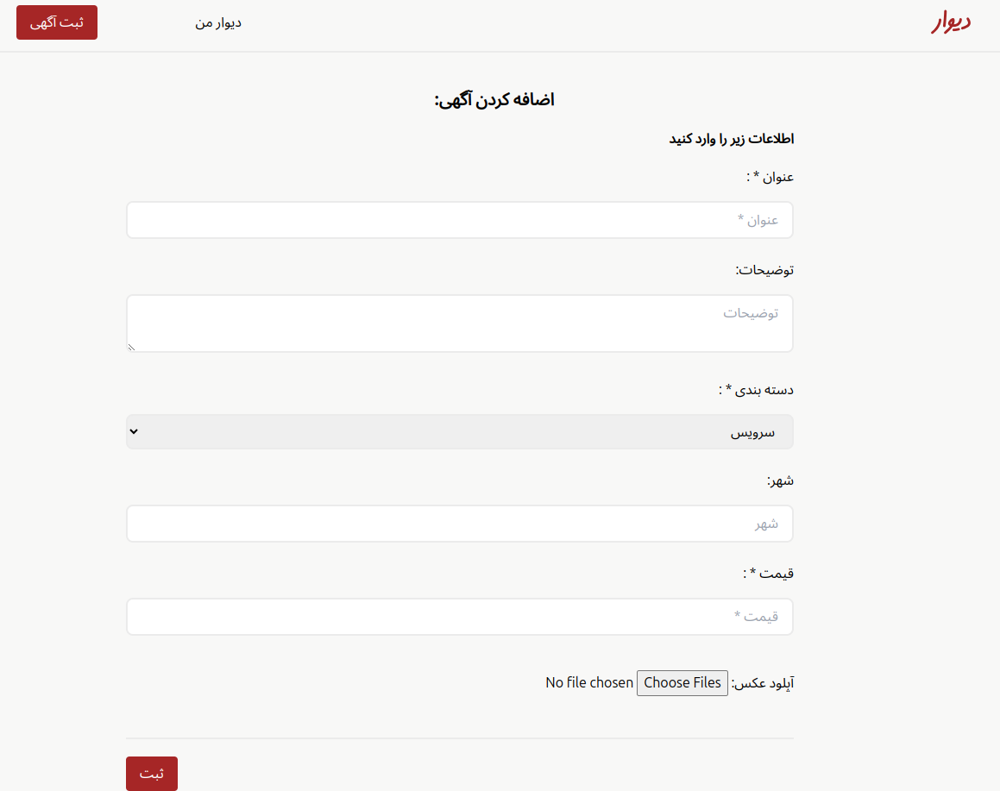
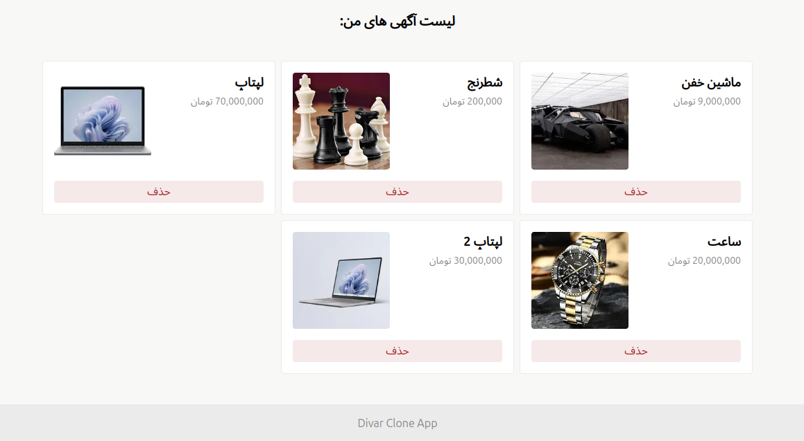
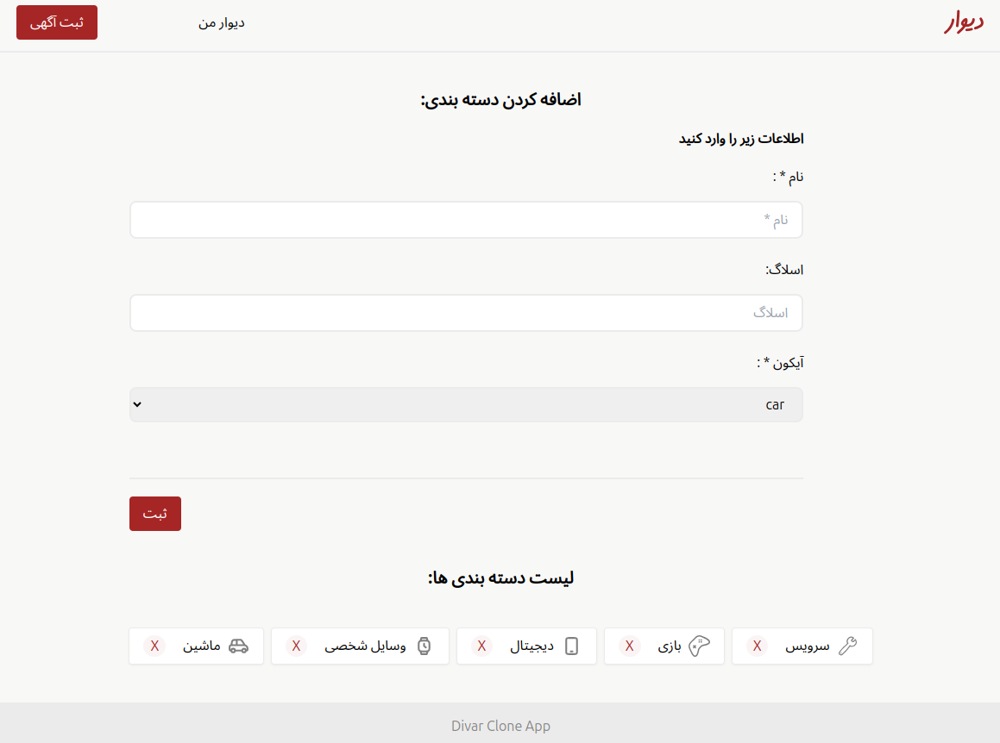
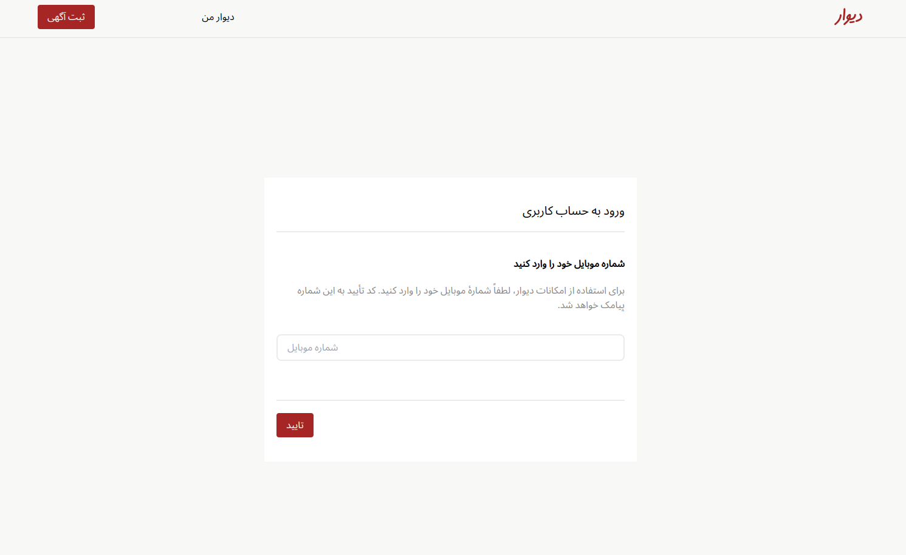
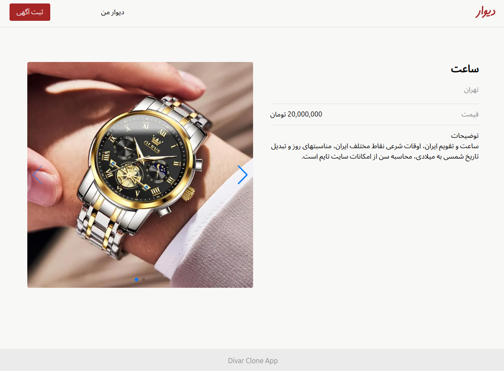

# Divar Clone App

This is a clone of the Divar site built with modern web technologies. The app replicates the core functionalities of Divar, including listing advertisements, user interactions, and more.

## Technologies Used
- Next.js App Router: For routing and server-side rendering.
- TypeScript: For static type checking and enhancing code quality.
- Tailwind CSS: For rapid and responsive UI development.
- React Hook Form: For managing form state and validation.
- RTK Query: For data fetching and state management.

## Pages
The app consists of the following main pages:
- Home Page: `/`
    
  
- User Panel: `/dashboard/user-panel`
    
      
  
- Admin Panel: `/dashboard/admin-panel`
      
  
- Login Page: `/auth`
      
  
- Show Post Page: `/post/[id]`
      


## Getting Started
Follow these steps to set up and run the project on your local machine.

### Prerequisites
Make sure you have the following installed:
- Node.js (v14.x or later)
- npm or yarn

### Installation
1. Clone  the repository:
```bash
git clone https://github.com/yourusername/divar-clone-app.git
cd divar-clone-app
```

2. Install dependencies:
```bash
npm install
# or
yarn install
```

## Running the Development Server
To start the development server, run:
```bash
npm run dev
# or
yarn dev
```
Open http://localhost:3000 with your browser to see the result.

## Building for Production
To create an optimized production build, run:
```bash
npm run build
# or
yarn build
```
You can then start the production server with:
```bash
npm run start
# or
yarn start
```
## Environment Variables
Create a .env.local file in the root of your project and add any necessary environment variables there. For example:
```bash
NEXT_PUBLIC_API_URL=https://api.yourbackend.com
```
